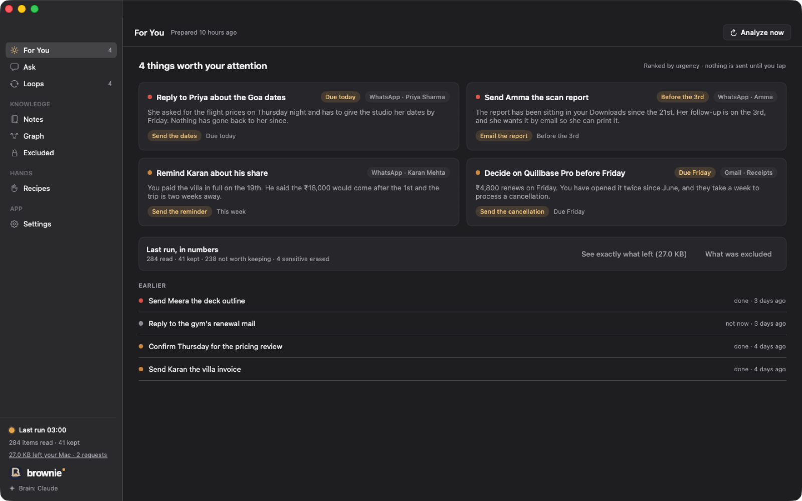
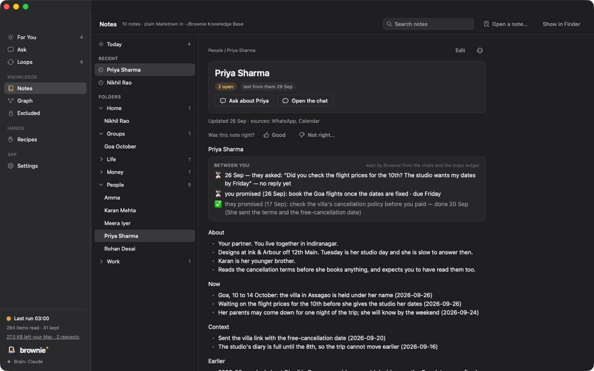
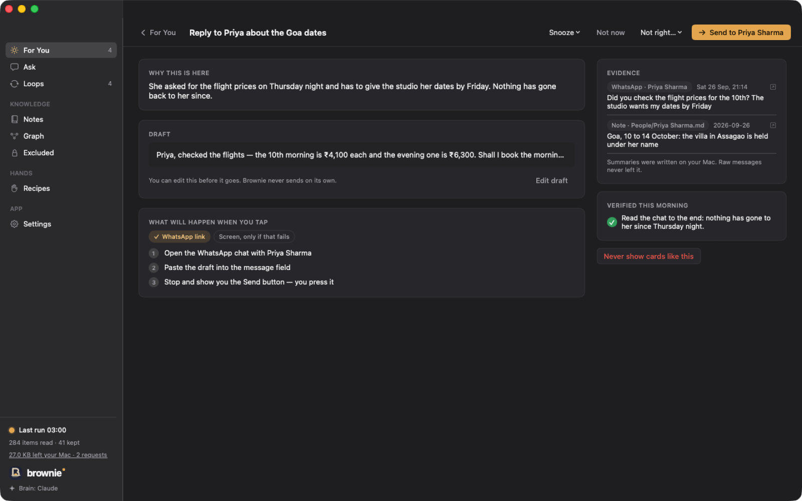
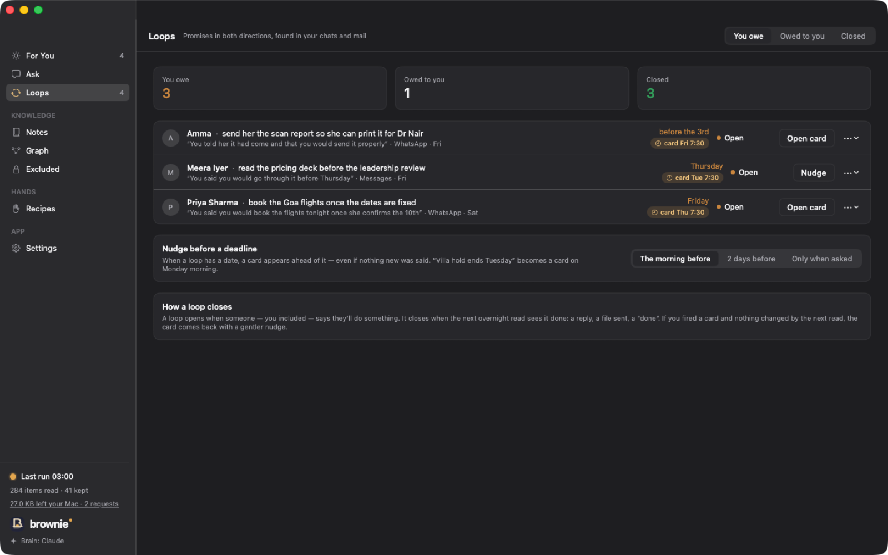

# Brownie

**A house spirit that lives in your Mac.** Every night, while the Mac is plugged in and you are asleep, Brownie wakes it, reads what is new in your life with a model that never leaves the machine, writes private notes, and leaves a handful of morning cards. **Hands** does the steps for you in your own apps, and stops one step short of Send.

[**Download for macOS**](https://github.com/Brownie-app/brownie/releases/latest) · [usebrownie.com](https://usebrownie.com) · Free, AGPL-3.0, no account, no server



*Apple silicon · macOS 14 or later · your own OpenAI or Claude key, or no key at all*

---

## What it actually does

**It reads at night, on this Mac.** Files, WhatsApp, iMessage, Telegram, Apple Notes, Gmail, Calendar, Slack, Teams, and meeting recordings transcribed by Apple's own speech engine. A small model on your GPU decides what is worth keeping. Almost everything is thrown away.

**It keeps one note per person, forever.** What they asked you, what you promised them, what is still open between you. Written by code, not by the model, so it cannot drift.



**It leaves four things in the morning, not a feed.** Each card says why it matters, shows the message it came from, and drafts a reply in your own words.



**It stops before Send.** Hands opens the chat, types the message, and hands you the button. That is the whole design, and it is enforced in code, not in a prompt.

**It tracks promises in both directions** — yours and theirs — and brings a card back if the next night sees no reply.



## What leaves your Mac

| | |
|---|---|
| Your messages, mail, files, notes | **Never leave.** The reader runs on your GPU. |
| Short summaries | Go to the brain *you* chose — or nowhere, in This Mac only mode. |
| Every byte that goes out | Listed in **What left your Mac**, byte for byte, in the app. |
| Accounts, telemetry, crash reports | None. There is nothing to sign up for and no Brownie server. |

A sensitive item — an account number, a medical detail — leaves no trace at all: not a title, not a log line. There are tests for that.

## Run it

Requirements: Apple silicon, macOS 14+, Xcode 16.

```bash
brew install cmake gperf openssl@3
./Scripts/build-tdlib.sh                    # once: builds the Telegram library into Vendor/tdlib (~30 min)
./Scripts/bundle.sh && open dist/Brownie.app
```

The first launch walks you through: downloading the reader (Gemma 4 E4B, 3.7 GB, public), choosing a brain (your own OpenAI / Anthropic / OpenRouter key, or a local server), picking sources, permissions, the overnight time, and the first read.

For development, put your keys in `.secrets/brownie.env` (git-ignored; Debug builds read it). Gmail and Telegram need your own Google OAuth client and Telegram api_id/api_hash there — Brownie ships none. See `docs/launch-setup.md`.

```bash
swift build && swift test          # 709 tests: cursors, atomic commit, fail-closed parsing, PII backstop, windowing
swift run browniectl list files ~/Documents
swift run browniectl read files ~/Downloads   # judge a folder with the reader from Terminal
```

## Where things are

| Path | What |
|---|---|
| `docs/spec/` | The behavioural spec — start with `00-overview.md` |
| `design/` | The design canvas source (`*.dc.html`); `design/v2/` is the second prototype |
| `Sources/Domain` | Value types and protocols; depends on nothing |
| `Sources/Ingest` | The reading pipeline + the reader's prompts (`Prompts/*.md`) |
| `Sources/Inference` | LiteRT-LM reader, model download |
| `Sources/LocalSources` | Files, Apple Notes, iMessage, WhatsApp |
| `Sources/Privacy` | PII backstop and the sensitivity policy |
| `Sources/Brain` | OpenAI-compatible and Claude engines, our own tool loops |
| `Sources/Knowledge` | The Markdown knowledge base, index, agentic builder |
| `Sources/Proactive` | Judge → verify & prepare → fire |
| `Sources/Pipeline` | One run, end to end |
| `Sources/Scheduling` | 3 AM wake, root helper with deadman, power rules |
| `Sources/Agent` | Hands: accessibility-tree computer use with the never-press-Send policy |
| `Sources/BrownieApp` | SwiftUI app: every screen from the design, walkthroughs, menu bar |
| `Sources/CloudSources` | Gmail (own OAuth), generic MCP client + presets |
| `Sources/TelegramSource` | Telegram over TDLib |
| `Vendor/LiteRTLM` | Google's LiteRT-LM Swift package (Apache-2.0), manifest patched for Swift 6.0 |
| `Vendor/tdlib` | TDLib headers; the dylibs are built locally by `Scripts/build-tdlib.sh` |

## Invariants (tests exist for each)

1. Raw data never leaves the Mac; the brain only ever sees summaries.
2. Sensitive items leave zero trace — not a title, not a log line.
3. The reader's judgement fails closed: unparseable ⇒ dropped.
4. Nothing is sent, paid, submitted or deleted without your tap on that step.
5. Every card carries its evidence.
6. Run numbers are honest: read · kept · not worth keeping · sensitive erased.
7. No account; the Mac's copy is the truth; deletion is total.
8. Walkthroughs play once.

## Beyond the morning cards

**Loops** — promises in both directions, found in your chats; a card you fired comes back if the next read sees no reply. **Pre-meeting briefs** ten minutes before a meeting, from your People notes. **A Sunday letter** about the week. **Recipes** — teach Hands something by doing it once; it replays it by app link, accessibility tree, or (only where you allow) the screen, and stops before Send; runnable from ⌘⇧Space, Shortcuts and Siri (`brownie://run?recipe=…`). **What left your Mac** — every request to the brain, byte for byte. **This Mac only** — the reader doubles as the brain, nothing sent. **Panic wipe** — hold to erase everything. **Ask** — questions answered from your notes with citations that open the original. **The vault** — the knowledge base is an Obsidian vault with `[[wikilinks]]`, Open in Obsidian, and an iCloud Drive mirror for the phone. **Brownie as an MCP server** — `Brownie mcp` lets Claude Desktop, Cursor and any MCP app read your notes, on this Mac only, with a log of what they asked. **Daytime reads** — every hour or three while idle and on power. See `docs/spec/12-loops-briefs-recipes-trust.md`.

## Sources

Files (skips code projects and bulk folders) · Apple Notes · iMessage · WhatsApp Desktop · Calendar (EventKit) · Gmail (own Google sign-in) · Telegram (own api_id/api_hash) · work apps through MCP (Linear, GitHub, Notion, Slack, Granola presets, or any server).

## Not in this build yet

The sealed cloud mirror (v1.1) and self-updating builds — 0.1 has to be replaced by hand when a new version ships (`Scripts/sparkle-keys.sh` is ready; the feed is not).

## Eval

`swift test --filter EvalTests` scores the reader's prompts against `Tests/Eval/Corpus/corpus.json` (keep / drop / sensitive, no private-specific leaks, group-chat attribution). Add a case whenever the reader gets something wrong on your real data.

## Contributing and licence

Brownie is open source under the [GNU AGPL-3.0](LICENSE). Contributions are welcome — read [CONTRIBUTING.md](CONTRIBUTING.md) first; contributors sign a short [CLA](CLA.md) so the project can also be offered under a commercial licence. Security issues: [SECURITY.md](SECURITY.md).

Releases are built on the maintainer's Mac, signed with a Developer ID certificate and notarised by Apple — CI only builds and tests, so no signing key or credential ever lives on a server. The steps are in [RELEASING.md](RELEASING.md).

Third-party: LiteRT-LM (Apache-2.0), TDLib (BSL-1.0), OpenSSL (Apache-2.0), Sparkle (MIT), Gemma 4 weights under Google's Gemma terms (downloaded by the user, never redistributed here).

---

Inspired by all personal assistant apps and the architecture of Sentient OS · Made with ❤️ in India
